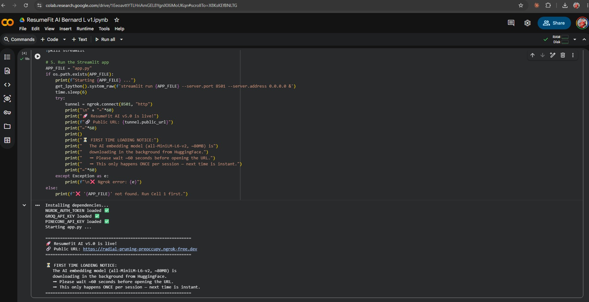
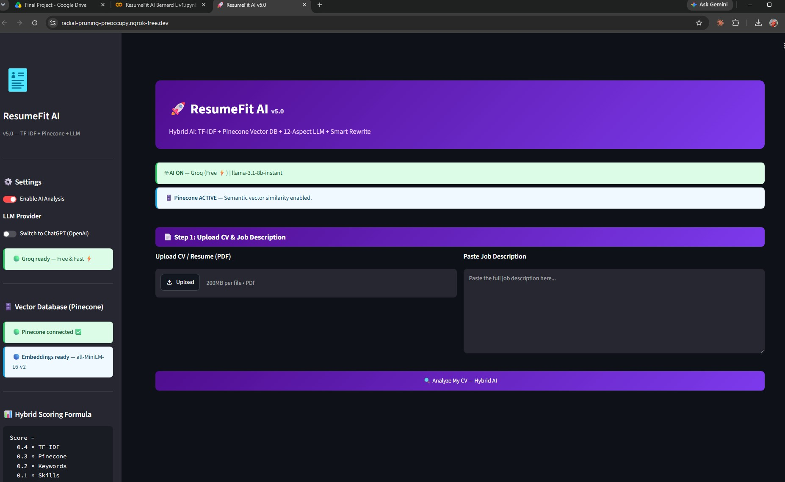
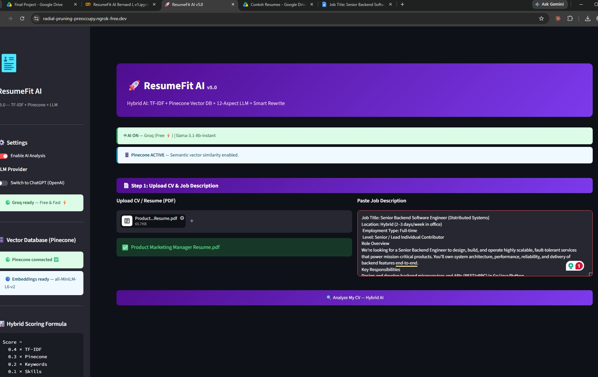
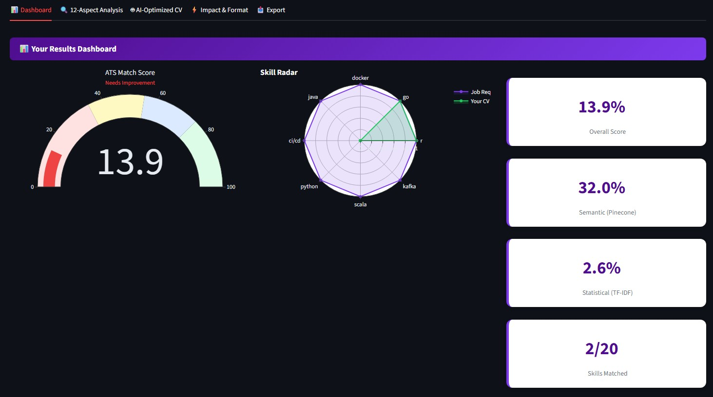
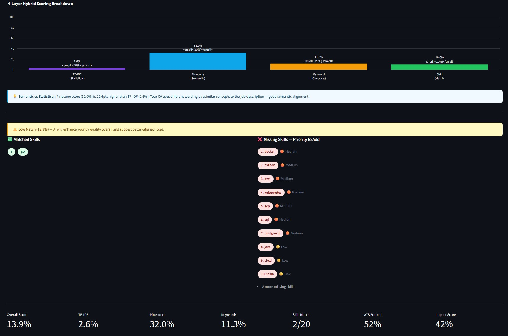
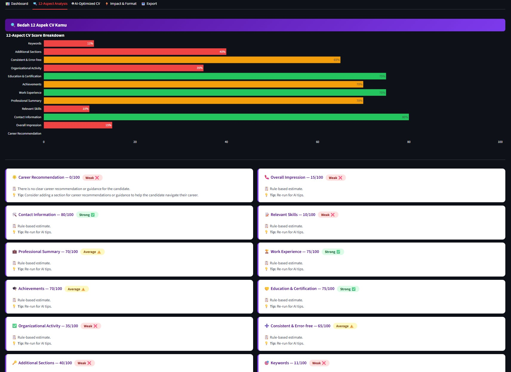
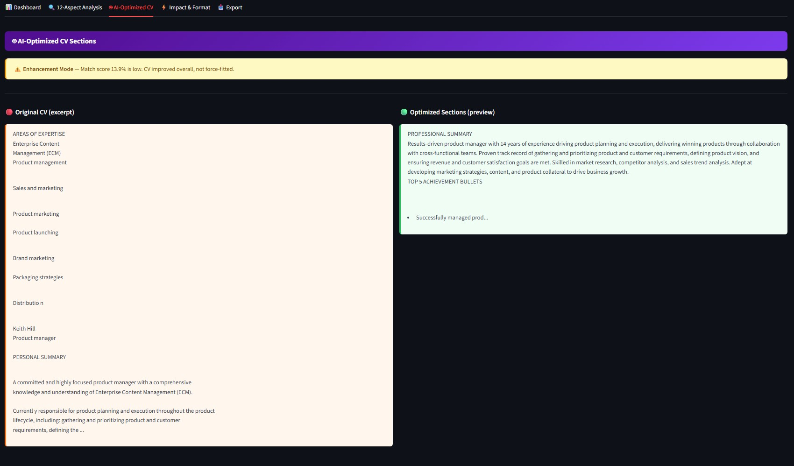
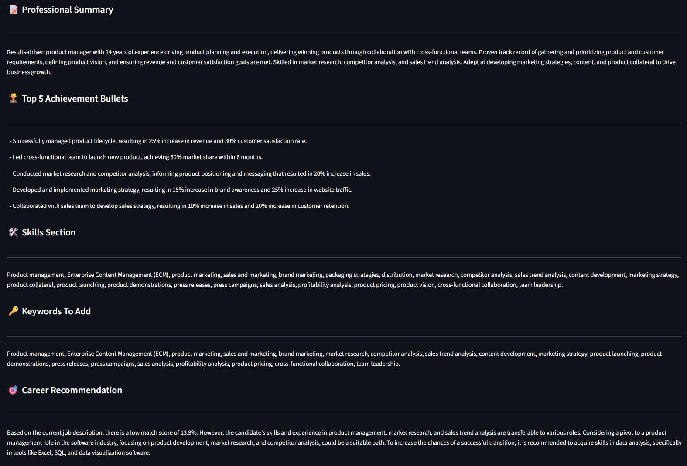
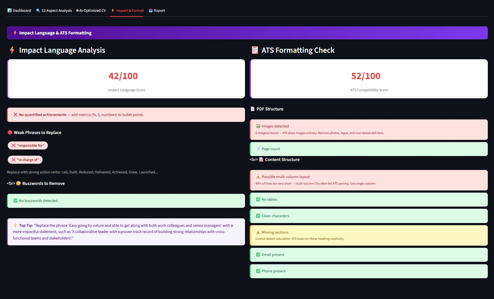
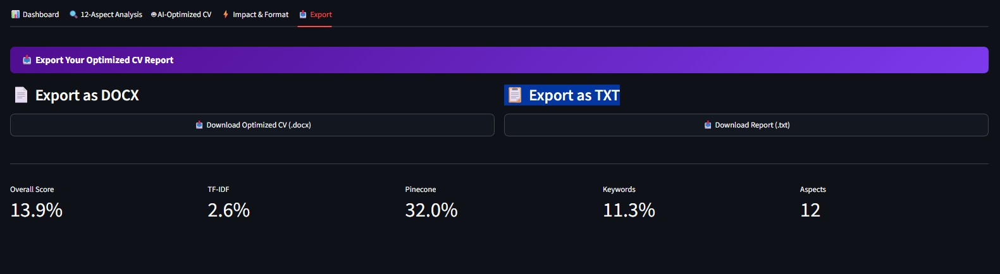

# 🚀 ResumeFit AI v5.0 Final
### ATS Matching & CV Optimization System

> **Final Project — Ruangguru AI Engineering Bootcamp Batch 11**
> Bernard Lokasasmita


[](https://colab.research.google.com/drive/1EeoavttYTLHriAmGEL8YgnXIXiMoUKqn)

---

## 📋 Table of Contents

- [Screenshots](#-screenshots)
- [Live Demo](#-live-demo)
- [Overview](#-overview)
- [Features](#-features)
- [System Architecture](#-system-architecture)
- [Scoring Formula](#-scoring-formula)
- [Tech Stack](#-tech-stack)
- [Quick Start](#-quick-start-google-colab)
- [How to Use](#-how-to-use)
- [12 CV Evaluation Aspects](#-12-cv-evaluation-aspects)
- [Impact Language & ATS Format Checks](#-impact-language--ats-format-checks)
- [Challenges & Learnings](#-challenges--learnings)
- [Project Structure](#-project-structure)
- [Future Roadmap](#-future-roadmap)
- [Author](#-author)

---

## 📸 Screenshots

### 1. Colab Startup — App Goes Live

*All API keys loaded, Streamlit started, ngrok tunnel printed in seconds*

### 2. Landing Page

*ResumeFit AI v5.0 — Groq AI ON, Pinecone ACTIVE, Hybrid Scoring Formula visible in sidebar*

### 3. Upload CV & Paste Job Description

*Step 1: Upload a CV PDF and paste the full job description, then click Analyze*

### 4. Dashboard — ATS Score & Skill Radar

*ATS Match Score gauge, Skill Radar chart (Job Req vs. Your CV), and per-layer sub-scores*

### 5. Dashboard — 4-Layer Scoring Breakdown & Missing Skills

*Bar chart showing TF-IDF / Pinecone / Keyword / Skill weights, plus prioritized missing skill list*

### 6. 12-Aspect CV Analysis

*LLM-powered breakdown across 12 quality dimensions — each scored and flagged as Strong / Average / Weak*

### 7. AI-Optimized CV — Side-by-Side Rewrite

*Original CV excerpt (left) vs. AI-optimized version (right) — Enhancement Mode active for low-match CVs*

### 8. AI Rewrite Output — Summary, Achievements & Keywords

*Rewritten Professional Summary, Top 5 Achievement Bullets, Keywords to Add, and Career Recommendation*

### 9. Impact Language & ATS Formatting Check

*Weak phrases detected, ATS formatting score, image/layout warnings, and contact info check*

### 10. Export

*Download full optimized CV report as .docx or .txt*

---

## 🎬 Live Demo

> **For Coaches & Reviewers:** The app runs on Google Colab + ngrok (see instructions below).
> A live demo session was recorded during submission — see `ResumeFit-Final.pdf` for screenshots and the demo URL.

**To run the demo yourself (takes ~2 minutes):**

1. Open [`ResumeFit AI Bernard L v1.ipynb`](./ResumeFit%20AI%20Bernard%20L%20v1.ipynb) in Google Colab
2. Add 3 free API keys as Colab Secrets (instructions below)
3. Run both cells → a public URL is printed instantly
4. Click the URL to open the live app in your browser

> Sample CVs for testing are included in the [`Contoh Resumes/`](./Contoh%20Resumes/) folder.

---

## 📌 Overview

**ResumeFit AI** is an end-to-end AI application that helps job seekers understand exactly why their CV isn't passing ATS (Applicant Tracking System) filters — and gives them actionable steps to fix it.

Most job seekers send generic CVs without knowing which keywords are missing, which skills are misaligned, or why the wording isn't landing. ResumeFit AI solves this with a **4-layer hybrid AI scoring engine** that combines statistical NLP, semantic vector search, and generative AI into a single, easy-to-use app.

---

## ✨ Features

| Feature | Description |
|---|---|
| 🎯 **ATS Match Score** | Overall CV-to-JD compatibility score (0–100%) |
| 📊 **4-Layer Hybrid Scoring** | TF-IDF + Pinecone Semantic + Keyword Coverage + Skill Match |
| 🗄️ **Vector Database Matching** | Semantic similarity via Pinecone — captures meaning, not just keywords |
| 🔍 **12-Aspect CV Evaluation** | LLM-powered deep analysis across 12 quality dimensions |
| ⚡ **Impact Language Analysis** | Detects weak verbs, buzzwords, and missing quantified achievements |
| 📋 **ATS Formatting Check** | Flags multi-column layouts, images, tables, missing sections |
| 🤖 **AI CV Rewrite** | Smart rewrite: tailors CV if match ≥60%, enhances overall quality if <60% |
| 📥 **Export** | Download full report as `.docx` or `.txt` |

---

## 🧠 System Architecture

```
┌─────────────────────────────────────────────────────────┐
│                    ResumeFit AI                          │
│                                                          │
│  INPUT                                                   │
│  ┌──────────┐    ┌──────────────────┐                   │
│  │ CV (PDF) │    │ Job Description  │                   │
│  └────┬─────┘    └────────┬─────────┘                   │
│       │                   │                              │
│  LAYER 2: Processing      │                              │
│  ┌────▼─────────────────▼─────────┐                     │
│  │  PDF Extractor → Text Cleaner  │                     │
│  │  Skill Extractor → Keywords    │                     │
│  └──────────────┬─────────────────┘                     │
│                 │                                        │
│  LAYER 3: Analysis Engine                                │
│  ┌──────────────▼─────────────────────────────────┐     │
│  │  Statistical  │  Semantic    │  Rule-Based      │     │
│  │  TF-IDF       │  Pinecone    │  Keyword/Skill   │     │
│  │  Cosine Sim   │  Embeddings  │  Gap Detection   │     │
│  └──────────┬────┴──────┬───────┴──────────────────┘     │
│             │  Program  │                                 │
│             │ Ingestion │ Model Embedding                 │
│             └────────►  Vector Database (Pinecone)        │
│                                                          │
│  LLM Layer (Groq / OpenAI)                              │
│  ┌─────────────────────────────────────────────────┐    │
│  │  12-Aspect Evaluation  │  Impact Language        │    │
│  │  CV Rewrite Suggestion │  Career Recommendation  │    │
│  └─────────────────────────────────────────────────┘    │
│                                                          │
│  LAYER 4: Output                                         │
│  Dashboard │ 12-Aspect │ AI Rewrite │ Format Check │ Export │
└─────────────────────────────────────────────────────────┘
```

---

## 📐 Scoring Formula

ResumeFit AI uses a **weighted hybrid formula** combining 4 layers:

```
Final Score = 0.4 × TF-IDF  +  0.3 × Pinecone  +  0.2 × Keywords  +  0.1 × Skills
```

| Component | Weight | Method |
|---|---|---|
| TF-IDF Cosine Similarity | 40% | `sklearn` TfidfVectorizer + cosine similarity |
| Pinecone Semantic Similarity | 30% | `sentence-transformers` embeddings + Pinecone vector search |
| Keyword Coverage | 20% | `∣KJ ∩ KR∣ / ∣KJ∣ × 100` |
| Skill Match | 10% | Rule-based dictionary matching |

> **Score Guide:** 🟢 75–100% Excellent &nbsp;|&nbsp; 🔵 55–75% Good &nbsp;|&nbsp; 🟡 35–55% Moderate &nbsp;|&nbsp; 🔴 0–35% Needs Work

### 🎯 Why These Weights?

The weights were deliberately chosen to **mirror how real-world ATS systems actually work**, not to maximise pure semantic accuracy:

- **TF-IDF at 40%** — Most commercial ATS platforms (Workday, Taleo, Greenhouse) are predominantly keyword-matching engines. Giving TF-IDF the highest weight accurately simulates their behaviour.
- **TF-IDF + Keyword Coverage = 60% combined** — This reflects the industry reality that ATS screening is still largely keyword-driven. A CV that shares vocabulary with the JD is more likely to pass automated filters.
- **Pinecone Semantic at 30%** — Adds modern NLP intelligence. Captures meaning and conceptual alignment beyond exact keyword matches — representing the direction ATS is evolving toward.
- **Skill Match at 10%** — Acts as a focused signal on top of keyword coverage, specifically targeting technical and soft skills that recruiters explicitly filter on.

> This is a deliberate design decision to simulate ATS behaviour accurately, not a limitation. A purely semantic model would score CVs differently from how real ATS systems do.

---

## 🏗️ Tech Stack

| Category | Technology |
|---|---|
| **Language** | Python 3.10+ |
| **UI** | Streamlit |
| **Statistical NLP** | Scikit-learn (TF-IDF, Cosine Similarity) |
| **Semantic Search** | Sentence-Transformers (`all-MiniLM-L6-v2`) |
| **Vector Database** | Pinecone (Serverless) |
| **LLM** | Groq (`llama-3.1-8b-instant`) — free default |
| **LLM (optional)** | OpenAI (`gpt-3.5-turbo`, `gpt-4o-mini`, `gpt-4o`) |
| **PDF Extraction** | PyPDF |
| **Visualization** | Plotly (gauge, radar, bar charts) |
| **Export** | python-docx |
| **Deployment** | Google Colab + ngrok |

---

## 🚀 Quick Start (Google Colab)

### 1. Clone / Download

```bash
git clone https://github.com/benloImA0G/AI-Boot-Camp-batch-11.git
```

Or download `ResumeFit AI Bernard L v1.ipynb` directly.

### 2. Set Up Secrets in Colab

> All 3 keys are **free**. Sign up takes under 2 minutes each.

In Google Colab → click the 🔑 **Secrets** icon (left sidebar) → add:

| Secret Name | Where to Get It | Required? |
|---|---|---|
| `NGROK_AUTH_TOKEN` | [ngrok.com](https://ngrok.com) → Sign up → Your Authtoken | ✅ Yes |
| `GROQ_API_KEY` | [console.groq.com](https://console.groq.com) → API Keys → Create | ✅ Yes (free) |
| `PINECONE_API_KEY` | [pinecone.io](https://pinecone.io) → Projects → API Keys | ✅ Yes (free) |

### 3. Run the Notebook

1. Open `ResumeFit AI Bernard L v1.ipynb` in [Google Colab](https://colab.research.google.com)
2. Run **Cell 1** → writes `app.py` to the Colab environment
3. Run **Cell 2** → installs all dependencies and starts the Streamlit app
4. Copy the printed **ngrok public URL** and open it in your browser

> The first run downloads the embedding model (~80MB from HuggingFace). Wait ~60 seconds before opening the URL.

### 4. Test the App

Use the sample CVs included in [`Contoh Resumes/`](./Contoh%20Resumes/) to test:
- Upload any of the 5 sample PDFs as your CV
- Paste a relevant job description
- Click **"Analyze My CV — Hybrid AI"**

---

## 📖 How to Use

1. **Upload your CV** as a PDF file
2. **Paste the Job Description** you're applying for
3. Click **"Analyze My CV — Hybrid AI"**
4. Explore the 5 tabs:
   - 📊 **Dashboard** — overall scores, skill match, radar chart
   - 🔍 **12-Aspect Analysis** — deep breakdown with tips per aspect
   - 🤖 **AI-Optimized CV** — rewritten sections tailored to the job
   - ⚡ **Impact & Format** — weak verbs, buzzwords, ATS compatibility
   - 📥 **Export** — download full report

---

## 🔍 12 CV Evaluation Aspects

| # | Aspect | Category |
|---|---|---|
| 1 | Overall Impression | General |
| 2 | Contact Information | General |
| 3 | Consistent & Error-free | General |
| 4 | Relevant Skills | Competency |
| 5 | Professional Summary | Competency |
| 6 | Work Experience | Competency |
| 7 | Achievements | Competency |
| 8 | Education & Certification | Background |
| 9 | Organizational Activity | Background |
| 10 | Additional Sections | Background |
| 11 | Keywords Optimization | ATS |
| 12 | Career Recommendation | ATS |

---

## ⚡ Impact Language & ATS Format Checks

### Impact Language
- Detects **weak verbs**: "responsible for", "assisted", "helped", "worked on"
- Detects **buzzwords**: "results-driven", "self-starter", "passionate", "synergy"
- Checks for **quantified achievements** (%, $, numbers)
- LLM-powered Impact Score (0–100) with specific actionable tip

### ATS Formatting
- 🖼️ Image/graphic detection (ATS cannot read images)
- 📄 Page count check (1–2 pages recommended)
- ⚠️ Multi-column layout detection
- ⚠️ Table detection (breaks ATS parsing)
- ✅ Required sections check (Experience, Education, Skills)
- ✅ Contact information check

---

## 📁 Project Structure

```
AI-Boot-Camp-batch-11/
│
├── ResumeFit AI Bernard L v1.ipynb   # Main Colab notebook — run this first
├── Backup ResumeFit AI Bernard L v1.ipynb  # Backup copy
├── app.py                             # Streamlit app source code
├── colab_runner.py                    # Colab launcher script (Cell 2)
├── requirements.txt                   # Python dependencies
├── ResumeFit-AI Final.pdf            # Final presentation slides
├── README.md                          # This file
├── screenshots/                       # App screenshots (full walkthrough)
│   ├── screenshot-1-colab-running.jpg
│   ├── screenshot-2-landing-page.jpg
│   ├── screenshot-3-upload-analyze.jpg
│   ├── screenshot-4-dashboard-score.jpg
│   ├── screenshot-5-dashboard-breakdown.jpg
│   ├── screenshot-6-12-aspects.jpg
│   ├── screenshot-7-ai-rewrite.jpg
│   ├── screenshot-8-ai-rewrite-output.jpg
│   ├── screenshot-9-impact-format.jpg
│   └── screenshot-10-export.jpg
└── Contoh Resumes/                    # Sample CVs for testing
    ├── Assistant Marketing Manager Resume.pdf
    ├── Product Marketing Manager Resume.pdf
    ├── Sales and Marketing Manager Resume.pdf
    ├── Job Title_ Senior Backend Software Engineer.docx
    └── Senior Backend Software Engineer.docx
```

---

## 🧗 Challenges & Learnings

Building ResumeFit AI end-to-end surfaced several real-world AI engineering challenges:

| # | Challenge | Solution | Learning |
|---|---|---|---|
| 1 | **Pinecone cold-start latency** — vector ingestion caused noticeable delays with no user feedback | Added real-time spinners and status messages during each ingestion step | User feedback during processing matters as much as final accuracy |
| 2 | **Inconsistent LLM output formatting** — Groq responses often broke the parser with unexpected structures | Strict prompt engineering with exact labeled output templates (`ASPECT:`, `SCORE:`, `TIP:`) | Structured prompts with explicit field names dramatically improve parsing reliability |
| 3 | **Image-based PDF parsing failures** — many real CVs use graphics, icons, and photo headers that PyPDF cannot extract | Built a dedicated ATS format checker that detects and warns users about image-heavy CVs before scoring | Detection of bad inputs is as valuable as the scoring itself |
| 4 | **Low-match CV force-fitting** — early versions tried to tailor every CV to the job regardless of match quality, producing dishonest rewrites | Implemented a dual strategy: tailor CV if score ≥60%, enhance overall quality if <60% without forcing the fit | AI should be honest with users, not just compliant with their requests |
| 5 | **Groq free-tier rate limits** — LLM calls occasionally hit rate limits mid-analysis, breaking the pipeline | Built a complete rule-based fallback engine that activates automatically when the LLM is unavailable | Every AI feature in a production app needs a reliable non-AI fallback |

---

## 🔄 Future Roadmap

| Version | Features |
|---|---|
| **V2.0** | Multi-job comparison, full Bahasa Indonesia support |
| **V3.0** | Job recommendation engine, CV auto-template generation |
| **V4.0** | Analysis history, public web deployment |
| **V5.0** | LinkedIn, JobStreet, and job portal integration |

---

## 👨‍💻 Author

**Bernard Lokasasmita**
Final Project — Ruangguru AI Engineering Bootcamp Batch 11
Completed: June 13, 2026

> *"AI yang baik bukan hanya yang akurat di notebook — tetapi yang bisa memberi nilai nyata kepada pengguna akhir."*
> ("Good AI is not just accurate in a notebook — it must deliver real value to end users.")

---

## 📄 License

MIT License — free to use, modify, and distribute.
